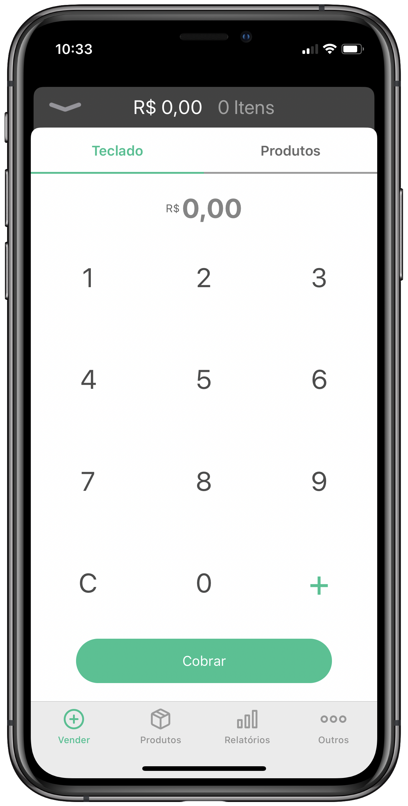
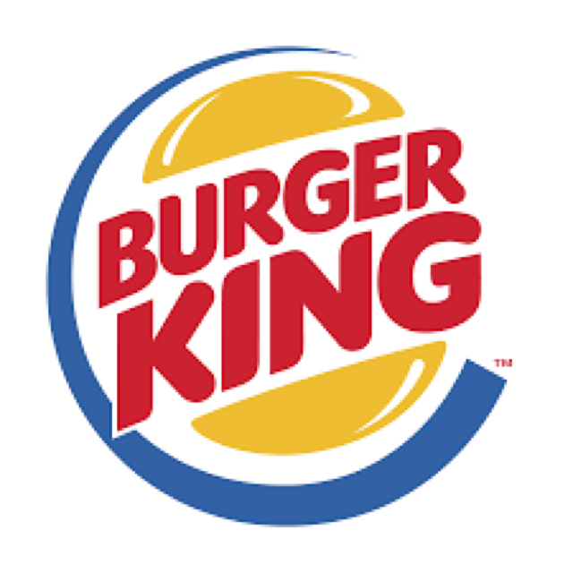

<!-- Header -->
<h1 align="center">Daniel Rocha</h1>
<h3 align="center">iOS Developer</h3>

<!-- Contacts -->

  
  
  

<!-- About of me -->

Comecei minha carreira em 2012 trabalhando com .NET, porém em 2015 decidi me aventurar no universo Apple onde me apaixonei. De lá pra cá participei de projetos incríveis onde tive a oportunidade de conhecer novas metodologias de desenvolvimento com pessoas extremamente competentes. Caso tenha interesse podemos marcar um bate papo para conversamos sobre essas experiências.

  

<h1 align="center">Projetos que tive participação</h1>

 

<h3 align="center">PagBank - PagSeguro</h3>

 

 PagBank é um banco digital voltado pessoas físicas e jurídicas 
 Estou trabalhando neste projeto desde 2017 sendo responsável pelo desenvolvimento e manutenção de toda a aba de vendas do aplicativo, estamos utilizando no projeto Swift, com integrações web, MVVM-C, SwiftLint, Google Analytics, testes unitários, testes de interface, GIT, code review, Jira Jenkins e Fastlane

  
   

 

<h3 align="center">Vendas - PagSeguro</h3>

 

 PagSeguro Vendas é um aplicativo voltado para pequenos vendedores 
 Estou trabalhando neste projeto desde 2015 desenvolvendo novas features e dando sustentação do mesmo, utilizando Swift, com integrações web, VIPER, SwiftLint, Google Analytics, testes unitários, testes de interface, GIT, code review, Jira Jenkins e Fastlane

 
  

 

<h3 align="center">Natura</h3>

 

Este é um aplicativo em que você pode comprar os cosméticos da casa de perfumaria Natura. 
Trabalhei neste projeto em 2016 criando novas features utilizamos Swift, com integrações web, GIT e Firebase.

 
  

 

<h3 align="center">Burger King</h3>

 

 Este é um aplicativo em que você pode comprar os lanches da rede Burger King Brasil. 
Trabalhei neste projeto em 2017 onde atuei na manutenção e criação de novas features, foi utilizado a linguagem Swift, com integrações web, GIT e JIRA

 
  

